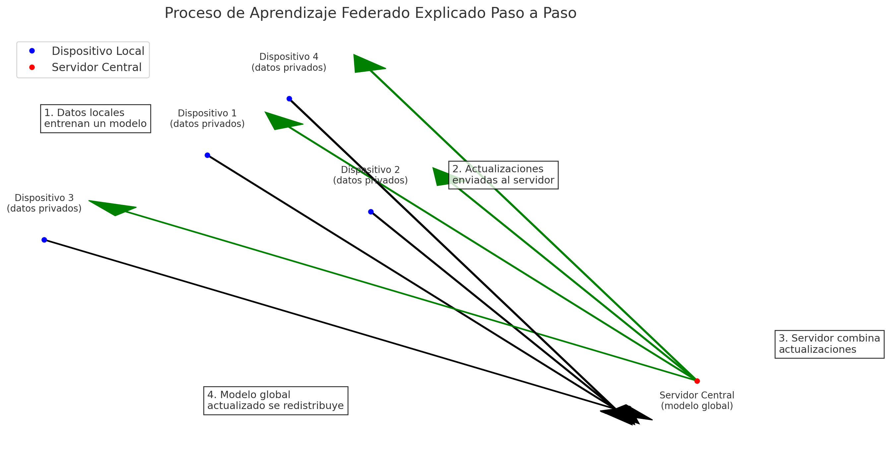

# Aprendizaje Federado

El **aprendizaje federado** es un método de entrenamiento de modelos de inteligencia artificial (IA) descentralizado, diseñado para preservar la privacidad de los datos al evitar que estos sean compartidos o centralizados.

## Proceso del Aprendizaje Federado

### 1. Concepto Básico
En lugar de enviar los datos de los usuarios a un servidor central para entrenar un modelo de IA, el modelo se entrena localmente en los dispositivos de los usuarios (como teléfonos móviles, tablets o dispositivos IoT). Luego, solo se envían **actualizaciones del modelo** (como los pesos entrenados) al servidor central, no los datos en sí.

### 2. Pasos del Proceso
1. **Inicialización del Modelo Central**  
   Se define un modelo de IA inicial en un servidor central, que se distribuye a los dispositivos participantes.
   
2. **Entrenamiento Local**  
   Cada dispositivo utiliza sus propios datos privados para entrenar una copia del modelo inicial de manera local.
   
3. **Envío de Actualizaciones**  
   Una vez completado el entrenamiento local, los dispositivos envían las actualizaciones del modelo al servidor central.

4. **Agregación Central**  
   El servidor central combina las actualizaciones recibidas de los dispositivos y genera una nueva versión del modelo global.

5. **Redistribución**  
   El modelo actualizado se redistribuye a los dispositivos para continuar el ciclo de aprendizaje.

## Beneficios
- **Privacidad Preservada:** Los datos no abandonan el dispositivo.
- **Cumplimiento Normativo:** Compatible con regulaciones como GDPR.
- **Descentralización:** Escalable en dispositivos distribuidos.
- **Eficiencia de Datos:** Aprovecha datos distribuidos sin centralizarlos.

## Ejemplo Práctico
Imagina un teclado predictivo que aprende de tus hábitos de escritura:
- Entrena localmente en tu dispositivo.
- Envía solo actualizaciones del modelo al servidor.
- El servidor mejora el modelo global y lo redistribuye a todos los dispositivos.

## Riesgos del Aprendizaje Federado
1. **Reidentificación:** Las actualizaciones pueden revelar patrones sensibles.
2. **Ataques de Envenenamiento:** Un dispositivo malicioso puede corromper el modelo.
3. **Ataques de Gradientes:** Posibilidad de reconstruir datos sensibles desde gradientes.
4. **Heterogeneidad:** Dispositivos con capacidades y datos desiguales.
5. **Latencia y Comunicación:** Requiere una red confiable para coordinar el proceso.
6. **Centralización Persistente:** El servidor sigue siendo un punto de riesgo.

## Aplicaciones Reales
- **Salud:** Modelos de diagnóstico entrenados sin compartir datos entre hospitales.
- **Tecnología de Consumo:** Mejoras en asistentes virtuales o aplicaciones de mensajería.
- **Finanzas:** Detección de fraude basada en datos locales protegidos.

## Representación Gráfica del Proceso

